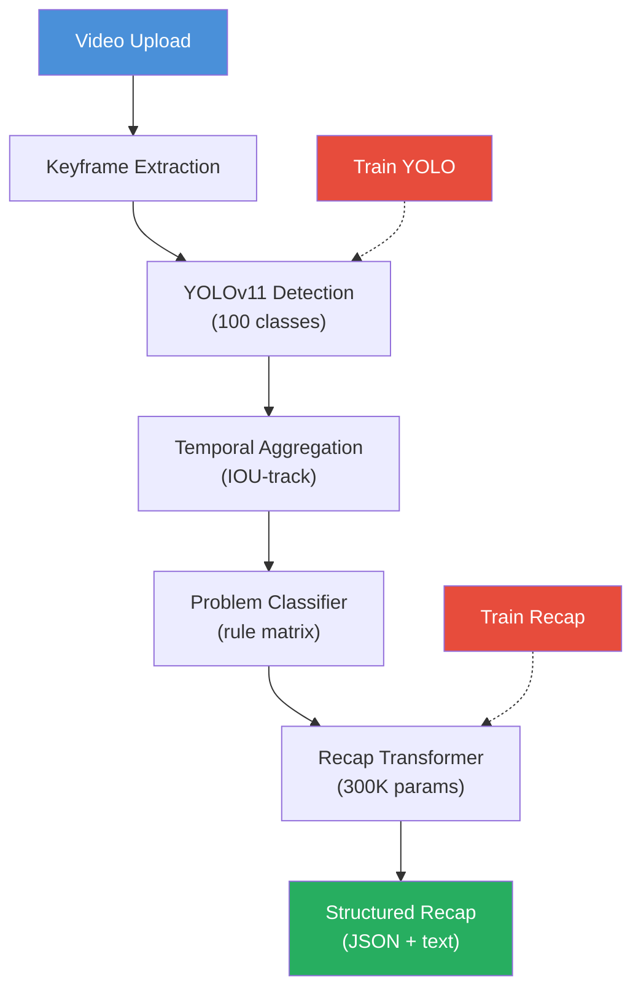

# Presentation Builder — Slides & Visuals (15 min)

## Timing Budget

| Slide | Content | Time |
|-------|---------|------|
| 1 | Title | 30s |
| 2 | Problem | 1m |
| 3 | Pipeline overview | 2m |
| 4 | Dataset | 2m |
| 5 | Training | 2m |
| 6 | Inference pipeline | 2m |
| 7 | Recap generation | 1m30s |
| 8 | Results | 1m30s |
| 9 | Failure analysis | 1m30s |
| 10 | Limitations + Future | 1m |
| 11 | Q&A | — |
| **Total** | | **15 min** |

**Rule of thumb**: 1 slide per minute. If you go over on one, cut time from the next. Never skip the demo slide.

## Required Files

| File | Purpose |
|------|---------|
| `presentation/imgs/architecture.png` | Pipeline diagram (render mermaid below) |
| `presentation/imgs/dataset_grid.png` | Sample images per damage type |
| `presentation/imgs/detection_examples.png` | YOLO inference examples on damage |
| `presentation/imgs/recap_example.png` | Screenshot of CLI recap output |
| `presentation/imgs/training_curve.png` | Loss / mAP over epochs |
| `presentation/imgs/dataset_distribution.png` | Class distribution bar chart |
| `presentation/slides.pptx` | Final slide deck |

Generate 5 of the 6 images with:
```bash
pip install matplotlib seaborn
python tools/make_visuals.py
```

For `detection_examples.png`, uncomment `make_detection_grid()` in that file after YOLO training.

For `architecture.png`, render the mermaid diagram below at https://mermaid.live and export as PNG.

---

## Slide-by-Slide Content

### Slide 1 — Title (30s)
- **Title**: AI-Assisted Insurance Damage Assessment
- **Subtitle**: Car & Property Damage Detection from Video
- **Team**: [Your names]
- **Date**: [Presentation date]
- **Delivery**: Read title, say your names, move on. No time for anything else.

### Slide 2 — Problem Statement (1m)
- **Hook sentence**: "Insurance handlers watch 30 minutes of video per claim. We automate that to 2 minutes."
- **Text**: Claims handlers manually review hours of video. Slow, inconsistent, expensive.
- **Key numbers**: 15-30 min per claim video, ~20% human error rate. Target: <2 min automated + verification.
- **Visual**: Split screen — raw video (left) vs pipeline recap output (right)
- **Delivery**: 30s explain problem, 30s state your solution. One sentence for each number.

### Slide 3 — Pipeline Overview (2m)
- **Visual**: Architecture diagram (`presentation/imgs/architecture.png`)
- **Flow**: Video -> Keyframes -> YOLOv11 -> Temporal Aggregation -> Problem Classifier -> Recap Transformer
- **One sentence per box — 6 boxes, ~15s each = 2m total**
- **Delivery**: Point to each box as you explain. Pause at the end for 5s to let the diagram sink in.**
- Mermaid source for the diagram:


### Slide 4 — Dataset (2m)
- **Numbers**: 2,971 images, 100 damage classes across car + property
- **Breakdown**: Car damage 1,235 images (French dataset translated to English), Property damage 1,652 images, Original 84 images
- **Challenge**: Imbalanced — some classes have 5 samples, others have 80+
- **Merge process**: Three separate datasets aligned into one unified 100-class ID space
- **Visual**: Bar chart (`dataset_distribution.png`) + sample grid (`dataset_grid.png`)
- **Delivery**: 1m on numbers + how we built the dataset, 1m on the imbalance challenge. Don't list all 100 classes.

### Slide 5 — Training (2m)
- **Model**: YOLOv11n transfer-learned from COCO pretrained weights
- **Optimizations**: 4 bullet points only:
  - Freeze backbone first 10 epochs (head converges 3x faster)
  - Warmup LR + cosine decay
  - RAM caching (eliminates disk I/O)
  - Mixed precision (40% GPU speedup)
- **Visual**: Training curve (`training_curve.png`)
- **Fill in**: Final mAP@0.5 = [X] after [Y] epochs at bottom of slide
- **Delivery**: 1m on the model, 1m on optimizations. Read mAP number, don't explain the loss curves.

### Slide 6 — Inference Pipeline (2m)
- **Step-by-step** (max 2 sentences each):
  1. Scene detection -> 20-50 keyframes per video
  2. YOLOv11 -> per-frame damage boxes
  3. IOU tracking -> merge into damage tracks
  4. Rule classifier -> 5 insurance categories
  5. Recap transformer -> English summary
- **Visual**: Detection examples (`detection_examples.png`)
- **Performance**: ~2 min processing per 30s video on CPU
- **Delivery**: Walk through each step quickly. The diagram on slide 3 was the overview — here you give the details.

### Slide 7 — Recap Generation (1m30s)
- **Architecture**: GPT-style causal transformer (self-attention only, no cross-attention)
- **Size**: ~300K parameters, d_model=192, 4 layers, 6 heads
- **No external LLM**: Fully self-contained. No API calls, no data leakage.
- **Training**: 20K procedurally-generated synthetic samples
- **Inference**: ~3ms on CPU
- **Visual**: Terminal screenshot (`recap_example.png`)
- **Delivery**: Emphasize "no external LLM" — this is the differentiator. Read the example recap aloud (10s).
```
This car has sustained moderate damage across 2 area(s).
The most prominent issue is a dent on the hood. Additional
findings include a cracked front bumper. Bodywork and paint
repair recommended.
```
To generate the screenshot:
```bash
python cli.py infer --video demo_video.mp4 --model best.pt --recap-model models/recap_model.pt
```

### Slide 8 — Results (1m30s)
- **Metrics** (fill with actual values after training):
| Metric | Target | Achieved |
|--------|--------|----------|
| Detection mAP@0.5 | 0.60 | [___] |
| Keyframe coverage | 0.90 | [___] |
| Processing time | 2 min | [___] |
| Recap accuracy | 0.80 | [___] |
- **Visual**: Before/after: raw frame -> detection overlay -> recap text
- **Delivery**: Read the 4 numbers aloud. One sentence each. If a metric isn't available, say "pending" and move on. Don't make excuses.

### Slide 9 — Failure Analysis (1m30s)
- **3 failure cases** (30s each):
  1. **Missed hairline crack** — resolution too low, crack < 5px. Fix: multi-scale tiling.
  2. **Pre-existing scratch flagged as new** — no temporal baseline. Fix: mark low-conf as "existing".
  3. **Overcount in adjacent frames** — poor IOU linking. Fix: require min 3-frame track.
- **Visual**: Each case: input image (arrow), wrong output, correct output
- **Delivery**: 30s per case. State the problem, show the image, state the fix. Don't over-explain.

### Slide 10 — Limitations + Future (1m)
- **Current limitations** (read fast, 2-3 words each):
  - No temporal comparison
  - Imbalanced dataset
  - 640x640 context window
- **Future work** (read fast):
  - Pre/post incident video comparison
  - Synthetic data for rare classes
  - Human-in-the-loop for uncertain cases
- **Delivery**: This is a rush slide. Read the limitations as a list, then the future work as a list. 30s each. Close with "Questions?" and move to slide 11.

### Slide 11 — Thank You / Q&A
- **Contact info**
- **QR code / link**: `github.com/ANTI-AXIOM/AI-3J`
- **Live demo** (only if time permits):
  ```bash
  python cli.py infer --video demo.mp4 --model best.pt --recap-model models/recap_model.pt
  ```
- **Delivery**: Thank the audience, show the QR code, ask for questions. If someone asks something you don't know, say "We haven't tested that yet but it's on our roadmap."

---

## Quick Reference: CLI Commands for Demo

```bash
# Train YOLO
python cli.py train --data dataset.yaml --epochs 100 --batch 80 --device 0 --benchmark benchmark.json

# Train recap model
python recap_model.py 30

# Full inference pipeline
python cli.py infer --video raw_dataset/sample.mp4 --model models/damage_detector/weights/best.pt \
  --recap-model models/recap_model.pt

# Generate visuals
python tools/make_visuals.py
```
