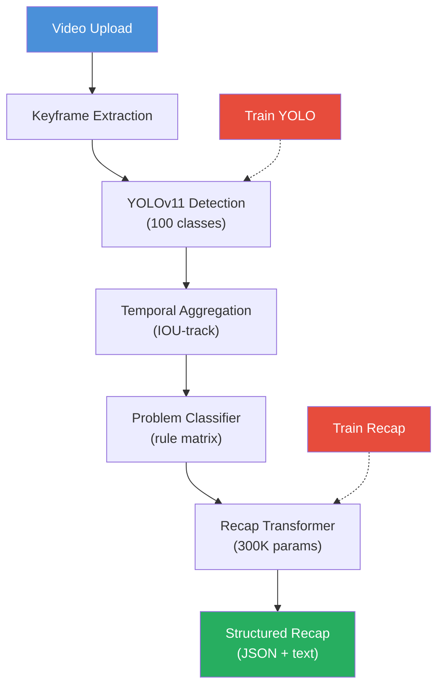

# Presentation Builder — Slides & Visuals

## Required Files

| File | Purpose |
|------|---------|
| `presentation/imgs/architecture.png` | Pipeline diagram (render mermaid below) |
| `presentation/imgs/dataset_grid.png` | Sample images per damage type |
| `presentation/imgs/detection_examples.png` | YOLO inference examples on damage |
| `presentation/imgs/recap_example.png` | Screenshot of CLI recap output |
| `presentation/imgs/training_curve.png` | Loss / mAP over epochs |
| `presentation/imgs/dataset_distribution.png` | Class distribution bar chart |
| `presentation/slides.pptx` | Final slide deck |

Generate 5 of the 6 images with:
```bash
pip install matplotlib seaborn
python tools/make_visuals.py
```

For `detection_examples.png`, uncomment `make_detection_grid()` in that file after YOLO training.

For `architecture.png`, render the mermaid diagram below at https://mermaid.live and export as PNG.

---

## Slide-by-Slide Content

### Slide 1 — Title
- **Title**: AI-Assisted Insurance Damage Assessment
- **Subtitle**: Car & Property Damage Detection from Video
- **Team**: [Your names]
- **Date**: [Presentation date]

### Slide 2 — Problem Statement
- **Text**: Insurance claims handlers manually review hours of video to assess damage. Slow, inconsistent, expensive.
- **Key numbers**: 15-30 min per claim video, ~20% human error rate on minor damage. Target: <2 min automated + human verification.
- **Visual**: Split screen showing raw video (left) vs pipeline recap output (right)

### Slide 3 — Pipeline Overview
- **Visual**: Architecture diagram (`presentation/imgs/architecture.png`)
- **Flow**: Video -> Keyframes -> YOLOv11 -> Temporal Aggregation -> Problem Classifier -> Recap Transformer
- **One sentence per box**
- Mermaid source for the diagram:


### Slide 4 — Dataset
- **Numbers**: 2,971 images, 100 damage classes across car + property
- **Breakdown**: Car damage 1,235 images (French dataset translated to English), Property damage 1,652 images, Original 84 images
- **Challenge**: Imbalanced - some classes have 5 samples, others have 80+
- **Merge process**: Three separate datasets aligned into one unified 100-class ID space
- **Visual**: Bar chart (`dataset_distribution.png`) + sample grid (`dataset_grid.png`)

### Slide 5 — Training
- **Model**: YOLOv11n transfer-learned from COCO pretrained weights
- **Optimizations**:
  - Freeze backbone first 10 epochs (> head converges 3x faster)
  - Warmup LR over 5 epochs + cosine decay
  - RAM caching (eliminates disk bottleneck after epoch 1)
  - Mixed precision FP16 (> 40% GPU speedup)
- **Visual**: Training curve (`training_curve.png`) showing loss decrease and throughput
- **Fill in**: Final mAP@0.5 = [X] after [Y] epochs

### Slide 6 — Inference Pipeline
- **Step-by-step**:
  1. Scene detection -> 20-50 keyframes per video
  2. YOLOv11 inference -> per-frame damage boxes with confidences
  3. IOU tracking across frames -> merge into persistent damage tracks
  4. Rule classifier -> map tracks to 5 insurance categories (collision, water, fire, storm, wear)
  5. CausalTransformer -> generate fluent English recap
- **Visual**: Detection examples (`detection_examples.png`) with bounding boxes
- **Performance**: ~2 min processing per 30s video on CPU

### Slide 7 — Recap Generation
- **Architecture**: GPT-style causal transformer (self-attention only, no cross-attention)
- **Size**: ~300K parameters, d_model=192, 4 layers, 6 heads
- **No external LLM**: Fully self-contained. No API calls, no data leakage.
- **Training**: 20K procedurally-generated synthetic samples with diverse sentence structures
- **Inference**: ~3ms on CPU
- **Visual**: Terminal screenshot (`recap_example.png`) showing:
```
This car has sustained moderate damage across 2 area(s).
The most prominent issue is a dent on the hood. Additional
findings include a cracked front bumper. Bodywork and paint
repair recommended.
```
To generate the screenshot:
```bash
python cli.py infer --video demo_video.mp4 --model best.pt --recap-model models/recap_model.pt
```

### Slide 8 — Results
- **Metrics** (fill with actual values after training):
| Metric | Target | Achieved |
|--------|--------|----------|
| Detection mAP@0.5 | 0.60 | [___] |
| Keyframe coverage | 0.90 | [___] |
| Processing time | 2 min | [___] |
| Recap accuracy | 0.80 | [___] |
- **Visual**: Before/after: raw frame -> detection overlay -> recap text

### Slide 9 — Failure Analysis
- **3 failure cases** (pick real examples from validation):
  1. **Missed hairline crack** - resolution too low, crack < 5px. Mitigation: multi-scale tiling.
  2. **Pre-existing scratch flagged as new** - no temporal baseline. Mitigation: mark low-confidence as "existing".
  3. **Overcount in adjacent frames** - poor IOU linking. Mitigation: require min 3-frame track.
- **Visual**: Each case shown as 3-panel: input image (arrow), wrong output, correct output

### Slide 10 — Limitations & Future Work
- **Current limitations**:
  - No temporal comparison (can't distinguish old vs new damage)
  - Imbalanced dataset (rare classes underperform)
  - Single-image YOLO misses context larger than 640x640
- **Future work**:
  - Temporal baseline: compare pre/post incident video
  - Synthetic data augmentation for rare classes
  - Multi-resolution pipeline for fine cracks / large surfaces
  - Human-in-the-loop: flag uncertain cases for manual review

### Slide 11 — Thank You / Q&A
- Contact info
- QR code / link: `github.com/ANTI-AXIOM/AI-3J`
- Live demo if time allows: `python cli.py infer --video demo.mp4 --model best.pt --recap-model models/recap_model.pt`

---

## Quick Reference: CLI Commands for Demo

```bash
# Train YOLO
python cli.py train --data dataset.yaml --epochs 100 --batch 80 --device 0 --benchmark benchmark.json

# Train recap model
python recap_model.py 30

# Full inference pipeline
python cli.py infer --video raw_dataset/sample.mp4 --model models/damage_detector/weights/best.pt \
  --recap-model models/recap_model.pt

# Generate visuals
python tools/make_visuals.py
```
